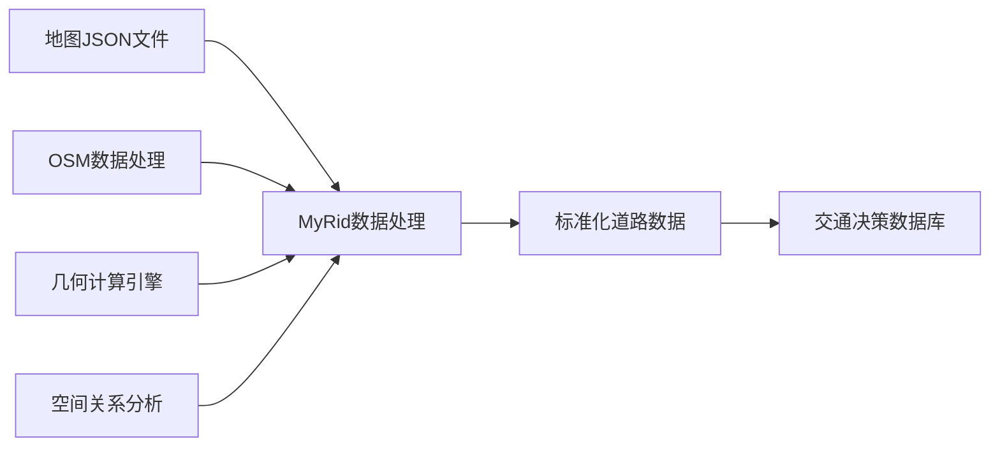

# 交通辅助决策系统数据处理方案

## 地图 JSON 数据入库技术方案沟通文档

---

## 📋 1. 项目背景与目标

### 1.1 项目概述

- **系统名称**: 交通辅助决策系统
- **核心需求**: 将地图部门提供的 JSON 格式交通要素数据，准确写入决策系统数据库
- **技术挑战**: 建立 JSON 数据与数据库表结构之间的映射关系

### 1.2 预期目标

- 实现地图 JSON 数据的自动化入库
- 确保数据完整性和准确性
- 建立可维护的数据处理流程
- 为辅助决策系统提供可靠的基础数据

---

## 📊 2. 现有资源清单

### 2.1 地图部门提供的 JSON 文件（18 种交通要素）

| 序号 | JSON 文件名         | 交通要素类型 | 数据特征     |
| ---- | ------------------- | ------------ | ------------ |
| 1    | 安全岛.json         | 道路安全设施 | 面状几何     |
| 2    | 斑马线.json         | 人行设施     | 线状几何     |
| 3    | 标线.json           | 道路标线     | 线状几何     |
| 4    | 车道\_outlines.json | 车道边界     | 线状几何     |
| 5    | 车道.json           | 车道信息     | 线状几何     |
| 6    | 导流带.json         | 交通导流     | 面状几何     |
| 7    | 地面箭头.json       | 指示标志     | 点状几何     |
| 8    | 地面文字符号.json   | 文字标识     | 点状几何     |
| 9    | 公交车站.json       | 公交设施     | 点状几何     |
| 10   | 交通灯.json         | 信号设施     | 点状几何     |
| 11   | 交通牌.json         | 标志设施     | 点状几何     |
| 12   | 禁停区.json         | 禁停区域     | 面状几何     |
| 13   | 路段面.json         | 路段区域     | 面状几何     |
| 14   | 路段中心线.json     | 路段中心     | 线状几何     |
| 15   | 路口点.json         | **路口节点** | **点状几何** |
| 16   | 路口形状.json       | **路口区域** | **面状几何** |
| 17   | 绿化带.json         | 绿化设施     | 面状几何     |
| 18   | 渠化段.json         | 渠化区域     | 面状几何     |
| 19   | 停车位.json         | 停车设施     | 面状几何     |
| 20   | 停止线.json         | 停车标线     | 线状几何     |

### 2.2 JSON 数据结构示例

```json
{
  "type": "FeatureCollection",
  "name": "路口点",
  "features": [
    {
      "type": "Feature",
      "properties": {
        "featureType": "ChinaIntersectionShape",
        "featureId": 486475,
        "lkid": "12Q4E099AN0",
        "lkmc": "全力二路与全力南路交叉口"
      },
      "geometry": {
        "type": "Point",
        "coordinates": [114.087743043054303, 30.447049572595585]
      }
    }
  ]
}
```

**关键字段分析**:

- `featureType`: 要素类型标识
- `featureId`: 要素唯一 ID
- `lkid`: 路口编码
- `lkmc`: 路口名称
- `coordinates`: 经纬度坐标

---

## 🗄️ 3. 目标数据库表结构

### 3.1 辅助决策系统核心表清单

| 序号 | 表名               | 功能描述     | 优先级 | 对应 JSON       |
| ---- | ------------------ | ------------ | ------ | --------------- |
| 1    | **路口基础表**     | 路口基本信息 | 🔴 高  | 路口点.json     |
| 2    | **区域路口关系表** | 路口区域关联 | 🔴 高  | 路口形状.json   |
| 3    | **区域基础表**     | 区域划分信息 | 🟡 中  | 路段面.json     |
| 4    | **路口方式基础表** | 路口类型配置 | 🟡 中  | 路口点.json     |
| 5    | **路段基础表**     | 路段基本信息 | 🔴 高  | 路段中心线.json |
| 6    | **路口转向基础表** | 转向关系配置 | 🔴 高  | 地面箭头.json   |
| 7    | **导向箭头基础表** | 导向箭头信息 | 🟡 中  | 地面箭头.json   |
| 8    | **车道基础表**     | 车道配置信息 | 🔴 高  | 车道.json       |
| 9    | **车道状态表**     | 车道状态信息 | 🟢 低  | 车道.json       |
| 10   | **标线基础表**     | 道路标线信息 | 🟡 中  | 标线.json       |
| 11   | **渠化基础表**     | 渠化区域信息 | 🟡 中  | 渠化段.json     |

### 3.2 关键表结构分析（以路口转向基础表为例）

**表名**: `t_base_cross_turn_info`

| 字段名    | 数据类型 | 长度 | 允许空 | 主键 | 说明                                                             |
| --------- | -------- | ---- | ------ | ---- | ---------------------------------------------------------------- |
| id        | char(15) | 15   | 否     | 否   | 转向 ID（路口 ID*驶入方向*转向类型）                             |
| turn_type | char(1)  | 1    | 否     | 否   | 转向类型：u 掉头；l 左转；s 直行；r 右转                         |
| in_dir    | int(11)  | 11   | 否     | 否   | 驶入方向：1 北，2 东北，3 东，4 东南，5 南，6 西南，7 西，8 西北 |
| out_dir   | int(11)  | 11   | 否     | 否   | 驶出方向：1 北，2 东北，3 东，4 东南，5 南，6 西南，7 西，8 西北 |

---

## 🔧 4. MyRid 项目技术分析

### 4.1 MyRid 项目定位

- **项目类型**: QGIS 插件，道路数据处理与 OpenLR 编码系统
- **核心功能**: OSM 数据 → RID 标准化 → OpenLR 编码
- **技术栈**: Python + PostgreSQL + PostGIS + Shapely

### 4.2 MyRid 与交通决策系统的关系



### 4.3 MyRid 项目可复用模块

| 模块              | 功能                 | 适用场景      |
| ----------------- | -------------------- | ------------- |
| `lib/common.py`   | 配置管理、数据库连接 | 数据库操作    |
| `lib/dbconn.py`   | PostgreSQL 连接      | 批量数据入库  |
| `src/osm2road.py` | 几何数据处理         | JSON 几何解析 |
| `lib/geohash.py`  | 地理编码             | 位置索引生成  |

---

## 💡 5. 数据处理方案设计

### 5.1 整体技术架构

```
地图JSON文件 → 数据解析器 → 几何处理 → 属性映射 → 数据库入库
     ↓             ↓           ↓         ↓         ↓
   18种要素    GeoJSON解析   坐标转换   字段匹配   批量插入
```

### 5.2 核心处理流程

#### 第一阶段：数据解析与验证

```python
# 1. JSON文件解析
def parse_geojson_file(json_file_path):
    """解析GeoJSON文件，提取要素信息"""

# 2. 几何数据验证
def validate_geometry(geometry):
    """验证几何数据的有效性"""

# 3. 属性数据清洗
def clean_properties(properties):
    """清洗和标准化属性数据"""
```

#### 第二阶段：坐标转换与几何处理

```python
# 1. 坐标系转换（WGS84 → 投影坐标）
def transform_coordinates(coords):
    """坐标系转换处理"""

# 2. 几何关系计算
def calculate_spatial_relations():
    """计算空间拓扑关系"""
```

#### 第三阶段：数据映射与入库

```python
# 1. JSON字段映射到数据库字段
FIELD_MAPPING = {
    "路口点": {
        "lkid": "intersection_id",
        "lkmc": "intersection_name",
        "coordinates": "geometry"
    }
}

# 2. 批量数据入库
def batch_insert_data(table_name, data_list):
    """批量插入数据到指定表"""
```

### 5.3 关键技术难点及解决方案

#### 难点 1：路口转向关系的生成

**问题**: JSON 中只有路口点和箭头，如何生成转向关系表？

**解决方案**:

```python
def generate_turn_relations(intersection_point, direction_arrows):
    """
    基于路口点和导向箭头生成转向关系
    1. 分析箭头的空间位置关系
    2. 计算驶入/驶出方向（8个方向）
    3. 确定转向类型（直行/左转/右转/掉头）
    """
    pass
```

#### 难点 2：车道与路段的关联

**问题**: 车道 JSON 和路段 JSON 如何建立关联关系？

**解决方案**:

```python
def link_lanes_to_segments(lane_features, segment_features):
    """
    通过空间关系建立车道与路段的关联
    1. 使用Shapely计算空间包含关系
    2. 基于几何中心点匹配
    3. 考虑缓冲区容错机制
    """
    pass
```

#### 难点 3：数据一致性保证

**问题**: 如何确保多个 JSON 文件间的数据一致性？

**解决方案**:

- 建立统一的 ID 编码规则
- 实施数据交叉验证机制
- 设置数据质量检查点

---

## 📋 6. 实施计划建议

### 6.1 分阶段实施策略

#### 阶段一：基础数据入库（2 周）

**目标**: 实现核心基础表的数据入库
**范围**:

- 路口基础表（路口点.json）
- 路段基础表（路段中心线.json）
- 车道基础表（车道.json）

#### 阶段二：关系数据构建（2 周）

**目标**: 建立各要素间的空间关系
**范围**:

- 区域路口关系表
- 路口转向基础表
- 导向箭头基础表

#### 阶段三：辅助要素入库（1 周）

**目标**: 完善其他交通要素数据
**范围**:

- 标线基础表
- 渠化基础表
- 其他辅助要素

### 6.2 技术准备工作

#### 需要地图部门配合的工作

1. **JSON 数据标准化**

   - 统一字段命名规范
   - 补充缺失的属性字段
   - 提供数据字典说明

2. **空间关系说明**

   - 各要素间的逻辑关系说明
   - 特殊情况的处理规则
   - 数据更新频率和方式

3. **测试数据提供**
   - 提供小范围完整测试数据
   - 包含各种复杂路口类型
   - 便于验证处理逻辑

#### 技术开发工作

1. **基于 MyRid 项目扩展开发**

   - 复用 MyRid 的几何处理能力
   - 扩展 JSON 解析模块
   - 增加数据映射配置

2. **数据处理工具开发**
   - JSON 批量解析工具
   - 数据质量检查工具
   - 入库进度监控工具

---

## ❓ 7. 待确认问题清单

### 7.1 数据源相关问题

1. JSON 文件的坐标系是什么？（WGS84/GCJ02/BD09?）
2. 数据更新频率如何？增量更新还是全量替换？
3. 是否有数据版本管理机制？
4. 异常数据的处理原则是什么？

### 7.2 业务逻辑相关问题

1. 路口转向关系的业务规则是什么？
2. 车道编号规则如何定义？
3. 路段与路口的边界如何划分？
4. 特殊路口（如环岛、复杂交叉口）如何处理？

### 7.3 技术实现相关问题

1. 数据库表结构是否可以调整？
2. 是否需要考虑历史数据迁移？
3. 数据入库的性能要求是什么？
4. 错误数据的回滚机制如何设计？

---

## 🚀 8. 下一步行动计划

### 8.1 短期行动（1 周内）

- [ ] 完善数据字典和字段映射关系
- [ ] 确定坐标系和数据格式标准
- [ ] 搭建开发测试环境
- [ ] 选择 1-2 个路口进行 POC 验证

### 8.2 中期目标（1 个月内）

- [ ] 完成核心数据处理模块开发
- [ ] 建立数据质量检查机制
- [ ] 完成小范围数据入库测试
- [ ] 制定批量处理方案

### 8.3 长期规划（3 个月内）

- [ ] 完成全量数据处理入库
- [ ] 建立自动化数据更新流程
- [ ] 优化系统性能和稳定性
- [ ] 完善监控和运维机制

---

## 📞 9. 联系方式与沟通机制

**项目组联系人**：[待补充]
**地图部门联系人**：[待补充]  
**技术支持**：[待补充]

**定期沟通机制**：

- 每周进度同步会议
- 技术问题及时沟通群
- 阶段性成果评审会

---

_文档版本：v1.0_  
_创建日期：2025 年 1 月 16 日_  
_更新日期：[待更新]_
